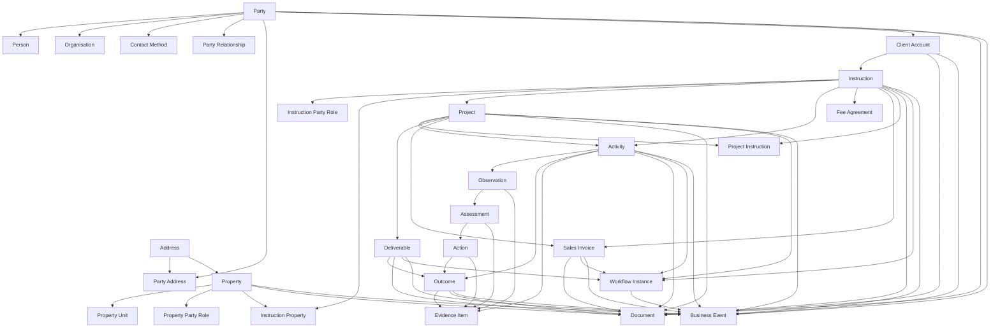

# Enterprise Relationship Model

## Purpose

Define the canonical relationships between the major enterprise objects in Perspective Business Manager.

This document is the relationship map for the platform. It explains how foundation objects, commercial objects, delivery objects, finance objects, workflow objects and record objects connect to each other.

## Design Rules

1. Relationships follow business meaning, not screen layout.
2. Shared enterprise objects may participate in many modules without being owned by those modules.
3. B2B and B2C journeys use the same relationship model.
4. Workflow, document, evidence and event relationships are cross-cutting layers.
5. New tables, APIs and routes should be explainable by this model.

## Master Relationship View



## Relationship Spine

The highest-value operational chain is:

```text
Party
  -> Client Account
    -> Instruction
      -> Project and/or Activity
        -> Observation
          -> Assessment
            -> Action
              -> Outcome
                -> Deliverable and Invoice context
```

This is not the only valid route through the data, but it is the main spine used to understand the enterprise lifecycle.

## Foundation Relationships

### Party

- `party` is the canonical root identity for organisations, individuals and intermediaries.
- `person` and `organisation` are specialisations of `party`.
- `contact_method` attaches to `party`.
- `party_relationship` links parties to one another.
- `party_address` links parties to addresses.
- `client_account` links commercial customer status to a party.

### Address And Location

- `address` may be linked to parties through `party_address`.
- `address` anchors `property`.
- `property` may then branch into `property_unit` and `property_party_role`.

### Customer Model

- B2B customer-of-record: organisation party plus client account.
- B2C customer-of-record: person party plus client account.
- intermediary-led case: customer, billing and representative parties linked through roles and relationships.

Detailed customer constraints are defined in [../requirements/06-customer-model-rules.md](../requirements/06-customer-model-rules.md).

## Commercial And Delivery Relationships

### Client Account To Instruction

- one party may have zero or many client accounts depending on business rules
- one client account may have many instructions
- one instruction belongs to one client account at a time

### Instruction To Parties And Properties

- `instruction_party_role` links an instruction to its customer-of-record, billing party, primary contact and other related parties
- `instruction_property` links an instruction to one or many properties
- one property may be linked to many instructions over time

### Instruction To Project

- one instruction may stand alone with no project
- one instruction may have one or many projects
- one project may coordinate one or many instructions through `project_instruction`

### Instruction And Project To Activity

- one instruction may spawn many activities
- one project may coordinate many activities
- an activity may be linked to an instruction, a project, a property or a combination of them

## Technical Finding Relationships

### Activity Chain

- one activity may produce many observations
- one observation may produce many assessments
- one assessment may produce many actions
- one action may produce many outcomes

### Outcome Attachment Variants

- an outcome may be linked to an action
- an outcome may be linked directly to an activity
- an outcome may be linked to a deliverable

This allows both technical and contractual reporting flows without duplicating result objects.

### Evidence Relationships

- evidence may attach to activity
- evidence may attach to observation
- evidence may attach to assessment
- evidence may attach to action
- evidence may attach to outcome

Evidence is supporting material, not a parallel operational object chain.

## Financial Relationships

### Fee Agreement

- one instruction may have one or many fee agreements over its lifecycle
- one fee agreement may support many invoices and WIP items

### Sales Invoice

- a sales invoice belongs to a client account
- a sales invoice may also reference an instruction, project or deliverable context
- one invoice may later have payments, credits and audit history attached

### Profitability Context

Commercial analysis should be derivable across these joins:

```text
Client Account -> Instruction -> Project -> Activity -> Outcome
Client Account -> Instruction -> Fee Agreement -> Sales Invoice
Property -> Instruction -> Activity -> Outcome
```

## Workflow Relationships

### Workflow Definition Layer

- `workflow_definition` owns workflow states and transitions
- `workflow_state` belongs to a workflow definition
- `workflow_transition` links states within a workflow definition

### Workflow Instance Layer

- `workflow_instance` links a workflow definition to a live business object
- `workflow_instance_state` records state progression for that instance

Typical workflow-enabled objects include:

- instruction
- project
- deliverable
- activity
- sales invoice

## Event Relationships

### Business Event

- `business_event` attaches to any significant business object through entity type and entity id
- workflow transitions, approvals, issues, uploads and financial changes should create events
- events are append-only and form the immutable history of the enterprise

## Document And Record Relationships

### Document Attachment Rule

Documents should attach to the object they support, such as:

- party
- client account
- instruction
- property
- project
- activity
- outcome
- deliverable
- sales invoice

Documents are not the parent object. They are controlled records attached to the business chain.

## Relationship Matrix

| Parent object                                  | Relationship        | Child or linked object        | Notes                               |
| ---------------------------------------------- | ------------------- | ----------------------------- | ----------------------------------- |
| Party                                          | specialises into    | Person, Organisation          | Customer root for B2B and B2C       |
| Party                                          | has many            | Contact Method                | Shared communication model          |
| Party                                          | links through       | Party Relationship            | Intermediaries and related parties  |
| Party                                          | has many            | Party Address                 | Reuses shared addresses             |
| Party                                          | may become          | Client Account                | Commercial relationship layer       |
| Address                                        | anchors             | Property                      | Shared location root                |
| Property                                       | has many            | Property Unit                 | Spatial hierarchy                   |
| Property                                       | has many            | Property Party Role           | Ownership and occupation context    |
| Client Account                                 | has many            | Instruction                   | Commercial to operational handoff   |
| Instruction                                    | has many            | Instruction Party Role        | Customer, billing and contact roles |
| Instruction                                    | has many            | Instruction Property          | Subject property linkage            |
| Instruction                                    | may have many       | Project                       | Managed delivery structure          |
| Instruction                                    | may have many       | Activity                      | Direct delivery work                |
| Instruction                                    | may have many       | Fee Agreement                 | Commercial basis                    |
| Instruction                                    | may have many       | Sales Invoice                 | Billing context                     |
| Project                                        | may coordinate many | Instruction                   | Via project_instruction             |
| Project                                        | has many            | Activity                      | Managed delivery work               |
| Project                                        | has many            | Deliverable                   | Contracted outputs                  |
| Activity                                       | has many            | Observation                   | Findings chain start                |
| Observation                                    | has many            | Assessment                    | Professional evaluation             |
| Assessment                                     | has many            | Action                        | Required response                   |
| Action                                         | has many            | Outcome                       | Resulting outputs or decisions      |
| Activity                                       | may have many       | Outcome                       | Direct outcome path                 |
| Deliverable                                    | may have many       | Outcome                       | Contractual output path             |
| Activity/Observation/Assessment/Action/Outcome | may have many       | Evidence Item                 | Supporting material                 |
| Workflow Instance                              | belongs to          | Business Object               | Lifecycle control                   |
| Business Event                                 | references          | Any Business Object           | Immutable history                   |
| Document                                       | attaches to         | Any supported business object | Controlled record layer             |

## Relationship Rules For New Design Work

1. New work should first identify the parent business object.
2. If the new concept is only a role or connection, prefer a relationship table over a new root entity.
3. If the new concept is evidence or paperwork, attach it to an existing business object.
4. If the new concept reflects a state change, approval or action history, prefer workflow and event layers.
5. If a design creates parallel B2B and B2C entity trees, it violates the canonical model.

## Questions To Ask Before Adding Any Object

1. Which parent or linked object does this belong to?
2. Is it a root entity, a role, a relationship, an event or a document?
3. Can it already be represented through party roles, instruction roles, property roles or workflow metadata?
4. Does it work for both organisation-led and individual-led customer journeys?
5. How will it be reported through the existing relationship chain?
